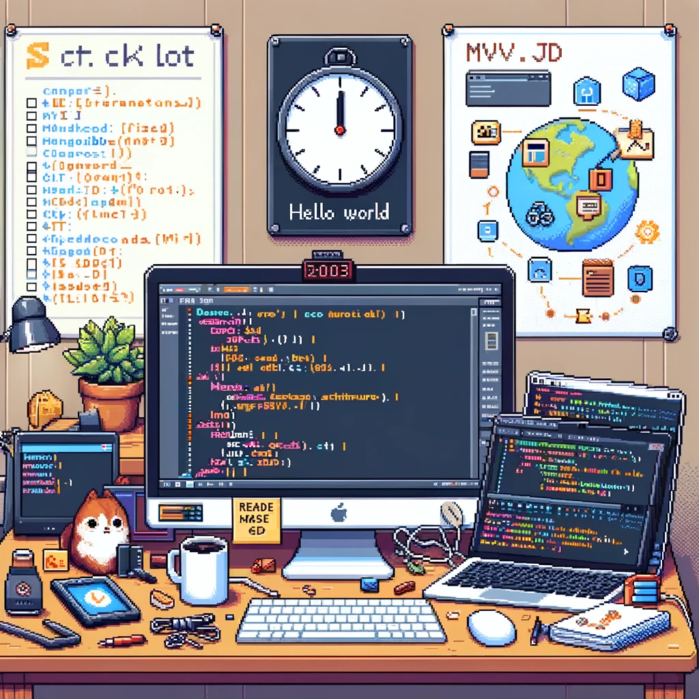

# Session 0: Initial Project Setup and Boilerplate

## Goal
To prepare the development environment and establish a project structure that will be used throughout the construction of the web application. This setup should create a solid foundation for implementing the various design patterns.

## Setup Checklist
- [ ] Install the necessary software (IDE, Git, .NET SDK, Node.js, etc.).
- [ ] Set up the local and remote repository for version control.
- [ ] Decide on the project's architecture (MVC, client-server, etc.).
- [ ] Establish coding standards and project conventions.

## Development Environment
1. Install Visual Studio or another preferred IDE that supports C# and .NET development.
2. Ensure that MongoDB is installed and running locally for development, or set up an account with MongoDB Atlas for cloud-based development.
3. Install Node.js to support the JavaScript frontend toolkit and any associated package managers (npm or Yarn).

## Project Repository Setup
1. Initialize a new Git repository.
2. Add a `.gitignore` file tailored for .NET and Node.js development to avoid committing unnecessary files.
3. Commit the initial project structure to the repository.

## Application Structure
- Set up a .NET Core Web Application with MVC pattern.
- Establish a directory structure that separates concerns (Controllers, Models, Views, Services, etc.).
- Create a basic `README.md` file describing the project.
- Implement a simple "Hello World" home page to confirm that the setup is working.

## Tasks
- Install all required software and tools.
- Create the project repository and commit the initial codebase.
- Set up the base MVC application with a simple routing example.
- Document the setup process and any commands used.

## Hosting Solution
- For the initial setup, use localhost for development.
- Create accounts with potential hosting providers (GitHub, Heroku, Azure, MongoDB Atlas) to be ready for deployment in future sessions.

## Expected Outcome
- A functional development environment.
- A remote repository with the initial project commit.
- A running web application with a basic "Hello World" page.

## Time Allocation
- Environment and tool setup: 1 hour.
- Repository and project structure setup: 1 hour.
- Initial application configuration and "Hello World" implementation: 1 hour.
- Documentation and planning for the next sessions: 1 hour.
